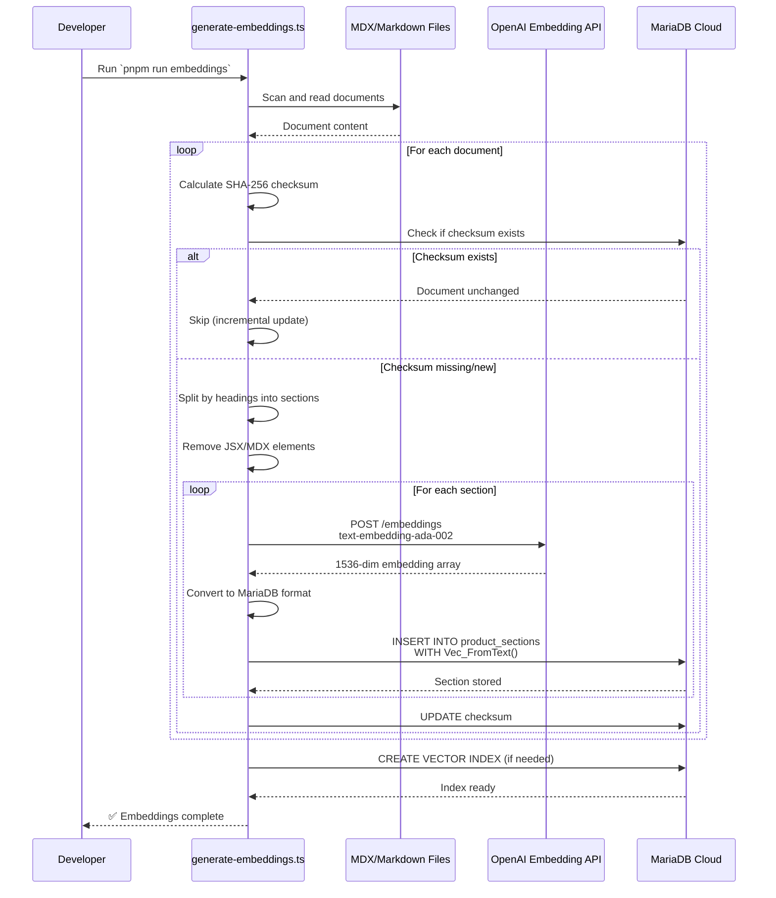
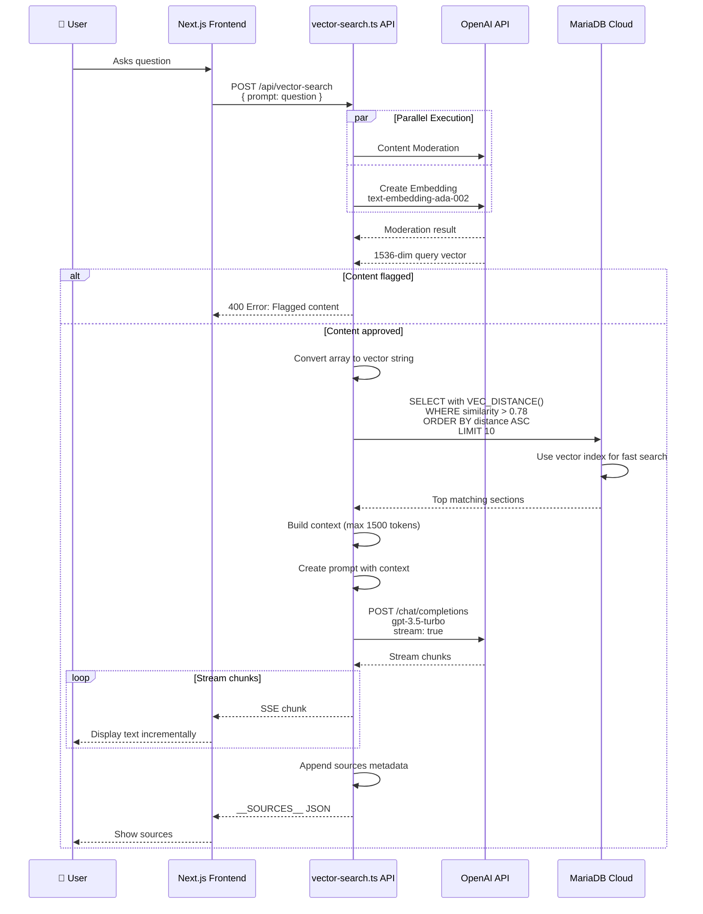
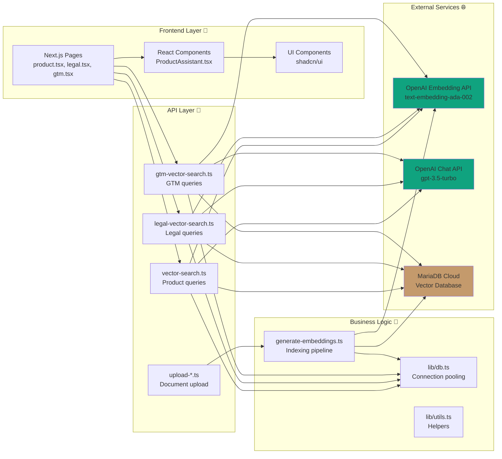
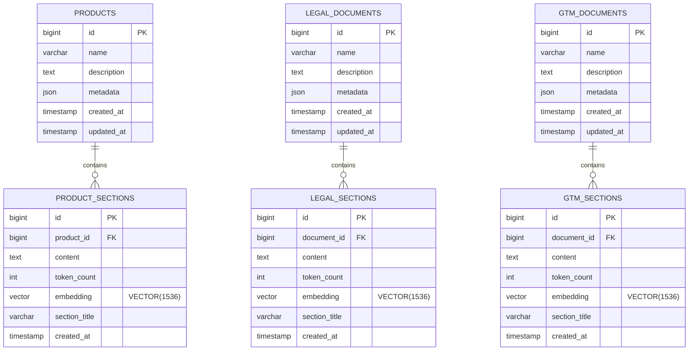
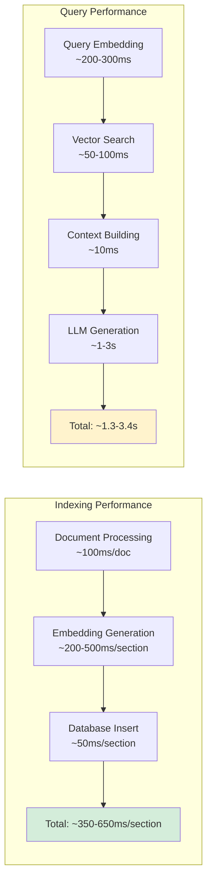
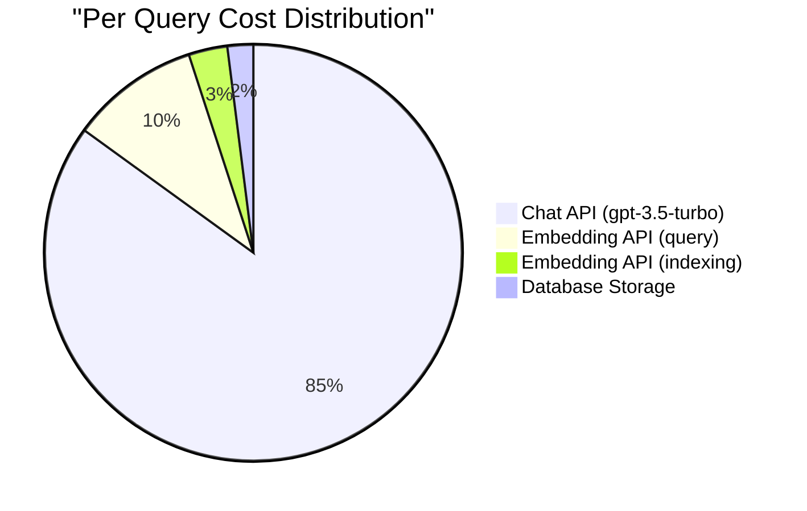
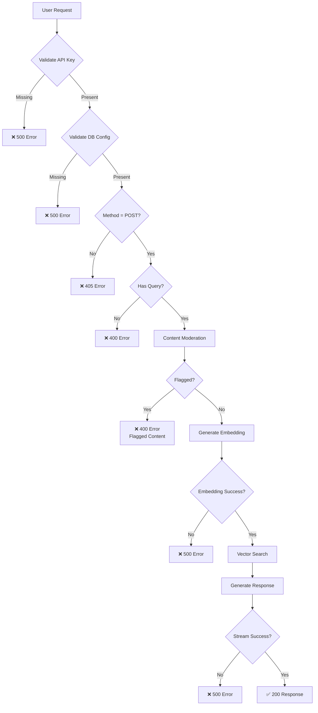
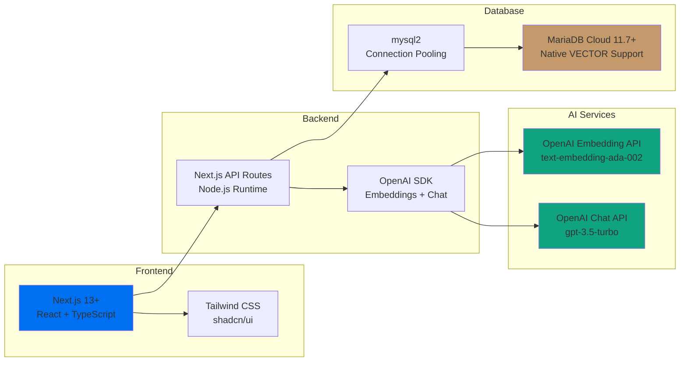

# 🏗️ Two-Phase AI Architecture

This document provides a comprehensive overview of the two-phase AI architecture powering the Sales Assistant application.

> 📚 **[← Back to README](./README.md)** | 🚀 **Quick Start**: See [README.md](./README.md#-getting-started) for setup instructions

### 🎯 Architecture at a Glance

| Aspect | Details |
|--------|---------|
| **Architecture Pattern** | Two-Phase AI (Indexing + Query) |
| **Indexing Strategy** | One-time document processing with incremental updates (checksum-based) |
| **Vector Dimensions** | 1536 (OpenAI text-embedding-ada-002) |
| **Similarity Metric** | Cosine Distance (optimized for normalized vectors) |
| **Similarity Threshold** | 0.78 (tuned for precision/recall balance) |
| **Context Window** | ~1500 tokens (top 5-10 sections) |
| **LLM Model** | gpt-3.5-turbo (streaming enabled) |
| **Database** | MariaDB Cloud 11.7+ with native VECTOR support |
| **Vector Index Type** | Approximate Nearest Neighbor (ANN) with cosine distance |

## 📑 Table of Contents

- [Architecture Overview](#-architecture-overview)
- [Detailed Data Flow](#-detailed-data-flow)
  - [Phase 1: Indexing Pipeline](#phase-1-indexing-pipeline)
  - [Phase 2: Query Pipeline](#phase-2-query-pipeline)
- [Component Architecture](#-component-architecture)
- [Database Schema](#-database-schema)
- [Vector Search Query Breakdown](#-vector-search-query-breakdown)
- [Performance Characteristics](#-performance-characteristics)
- [Cost Breakdown](#-cost-breakdown)
- [Security & Validation Flow](#-security--validation-flow)
- [Key Design Decisions](#-key-design-decisions)
- [Related Documentation](#-related-documentation)

## 📊 Architecture Overview

```mermaid
graph TB
    subgraph "PHASE 1: Indexing (Build Time) 📚"
        A[📄 Knowledge Base Documents<br/>MDX/Markdown Files] --> B[🔪 Chunk into Sections<br/>By Headings]
        B --> C[🧠 OpenAI Embedding API<br/>text-embedding-ada-002]
        C --> D[📊 1536-dim Vector Array<br/>[0.123, -0.456, 0.789, ...]]
        D --> E[💾 MariaDB Cloud<br/>VECTOR(1536) Type]
        E --> F[⚡ Vector Index<br/>DISTANCE=cosine, M=16]
        F --> G[(🗄️ Indexed Knowledge Base<br/>Fast Similarity Search)]
    end
    
    subgraph "PHASE 2: Query (Runtime) ⚡"
        H[👤 User Question] --> I[🛡️ Content Moderation<br/>Parallel Check]
        H --> J[🧠 OpenAI Embedding API<br/>text-embedding-ada-002]
        I --> K{✅ Approved?}
        K -->|❌ No| L[🚫 Reject Request]
        K -->|✅ Yes| J
        J --> M[📊 Query Vector<br/>1536-dim]
        M --> N[🔍 MariaDB Vector Search<br/>VEC_DISTANCE Function]
        N --> G
        G --> O[📋 Top 10 Relevant Sections<br/>Similarity > 0.78]
        O --> P[📝 Build Context Prompt<br/>~1500 tokens max]
        P --> Q[🤖 OpenAI Chat API<br/>gpt-3.5-turbo]
        Q --> R[📡 Streamed Response<br/>SSE to Frontend]
    end
    
    style A fill:#e1f5ff
    style G fill:#d4edda
    style Q fill:#fff3cd
    style R fill:#f8d7da
```

## 🔄 Detailed Data Flow

### Phase 1: Indexing Pipeline



### Phase 2: Query Pipeline



## 🎯 Component Architecture



## 💾 Database Schema



## 🔍 Vector Search Query Breakdown

```mermaid
graph TD
    A[User Query:<br/>'How to optimize performance?'] --> B[1. Generate Embedding]
    B --> C[Vector: 0.123, -0.456, ...<br/>1536 dimensions]
    C --> D[2. Convert to MariaDB Format]
    D --> E['[0.123,-0.456,0.789,...]']
    E --> F[3. Execute Vector Search Query]
    
    F --> G[WITH query_vector AS<br/>SELECT Vec_FromText? AS vec]
    G --> H[CROSS JOIN query_vector]
    H --> I[Calculate VEC_DISTANCE<br/>cosine distance]
    I --> J[Filter: similarity > 0.78<br/>1 - VEC_DISTANCE]
    J --> K[ORDER BY distance ASC<br/>Use vector index]
    K --> L[LIMIT 10<br/>Top matches]
    L --> M[Results: Sections with<br/>highest semantic similarity]
    
    style A fill:#e1f5ff
    style C fill:#fff3cd
    style M fill:#d4edda
```

## 🚀 Performance Characteristics



## 📈 Cost Breakdown



## 🔐 Security & Validation Flow



## 🎓 Key Design Decisions

### Why Two Phases?

1. **Separation of Concerns**: Indexing happens once (build time), queries happen repeatedly (runtime)
2. **Cost Optimization**: Expensive embedding generation happens once, not per query
3. **Performance**: Pre-indexed vectors enable sub-second similarity search
4. **Scalability**: Can handle millions of documents with efficient indexing

### Why MariaDB Vector Support?

- **Native Type Safety**: `VECTOR(1536)` enforces correct dimensionality
- **Optimized Storage**: Binary representation vs JSON/text
- **Built-in Functions**: `VEC_DISTANCE()`, `Vec_FromText()` native to database
- **Fast Indexes**: Approximate Nearest Neighbor (ANN) algorithms
- **Standard SQL**: Familiar interface with powerful extensions

### Why Cosine Distance?

OpenAI embeddings are normalized (magnitude = 1), making cosine distance ideal for semantic similarity:
- Cosine distance measures angle between vectors (semantic similarity)
- Euclidean distance would measure magnitude (not meaningful for normalized vectors)

### Why Similarity Threshold 0.78?

Based on empirical testing:
- **> 0.78**: Highly relevant matches (rare false positives)
- **0.70-0.78**: Moderately relevant (may include noise)
- **< 0.70**: Often irrelevant

Balances recall (finding relevant content) with precision (avoiding irrelevant content).

## 🛠️ Technology Stack



## 📚 Related Documentation

- **[README.md](./README.md)** - Main project documentation with setup instructions
- [MariaDB Vector Functions](https://mariadb.com/docs/server/ref/mdb/sql-statements/data-types/vector/) - Official MariaDB vector documentation
- [OpenAI Embeddings Guide](https://platform.openai.com/docs/guides/embeddings) - OpenAI embeddings best practices

