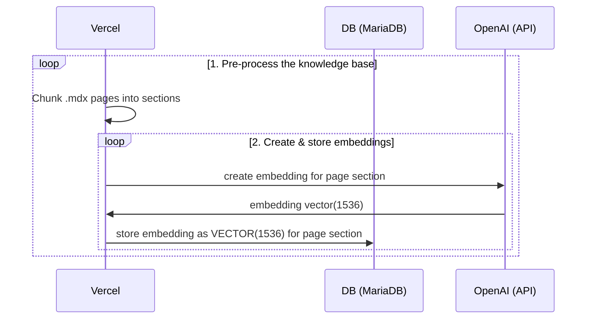
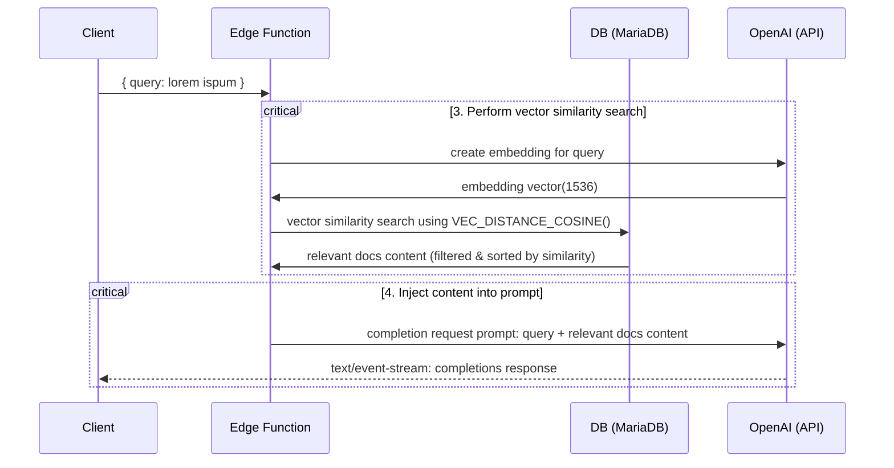

# Next.js OpenAI Doc Search Starter

This starter takes all the `.mdx` files in the `pages` directory and processes them to use as custom context within [OpenAI Text Completion](https://platform.openai.com/docs/guides/completion) prompts.

## Deploy

Deploy this starter to Vercel. Set up your MariaDB Cloud database and configure the required environment variables (see [Configuration](#configuration) below). All you have to do is set your `OPENAI_KEY` and database credentials and you're ready to go!

[

## Technical Details

Building your own custom ChatGPT involves four steps:

1. [👷 Build time] Pre-process the knowledge base (your `.mdx` files in your `pages` folder).
2. [👷 Build time] Store embeddings in MariaDB using native VECTOR type (requires MariaDB 11.7+).
3. [🏃 Runtime] Perform vector similarity search using MariaDB's native vector functions to find relevant content.
4. [🏃 Runtime] Inject content into OpenAI GPT-3 text completion prompt and stream response to the client.

## 👷 Build time

Step 1. and 2. happen at build time, e.g. when Vercel builds your Next.js app. During this time the [`generate-embeddings`](./lib/generate-embeddings.ts) script is being executed which performs the following tasks:



In addition to storing the embeddings, this script generates a checksum for each of your `.mdx` files and stores this in another database table to make sure the embeddings are only regenerated when the file has changed.

## 🏃 Runtime

Step 3. and 4. happen at runtime, anytime the user submits a question. When this happens, the following sequence of tasks is performed:



The relevant files for this are the [`SearchDialog` (Client)](./components/SearchDialog.tsx) component and the [`vector-search` (Edge Function)](./pages/api/vector-search.ts).

The database schema is stored in the [`migrations/init.sql`](./migrations/init.sql) file. Run this SQL script against your MariaDB Cloud database to create the necessary tables.

**Note:** This project requires MariaDB 11.7 or later for native VECTOR data type support and vector similarity search functions.

## Local Development

### Configuration

1. Create a `.env` file in the root directory
2. Set your `OPENAI_KEY` in the `.env` file
3. Set your MariaDB Cloud credentials in the `.env` file:
   ```
   DB_HOST=your-mariadb-host
   DB_PORT=3306
   DB_USER=your-mariadb-user
   DB_PASSWORD=your-mariadb-password
   DB_NAME=your-mariadb-database
   ```
   
   Alternatively, you can use the `MARIADB_*` prefix:
   ```
   MARIADB_HOST=your-mariadb-host
   MARIADB_PORT=3306
   MARIADB_USER=your-mariadb-user
   MARIADB_PASSWORD=your-mariadb-password
   MARIADB_DATABASE=your-mariadb-database
   ```

### Database Setup

1. Ensure your MariaDB Cloud instance is running MariaDB 11.7 or later (required for native VECTOR support).

2. Run the migration script against your MariaDB Cloud database:
   ```bash
   mysql -h your-host -u your-user -p your-database < migrations/init.sql
   ```
   
   Or connect to your database and run the SQL script directly:
   ```sql
   source migrations/init.sql;
   ```

3. Verify the vector index was created:
   ```sql
   SHOW INDEXES FROM nods_page_section;
   ```
   You should see an index named `idx_embedding` with type `VECTOR`.

### Start the Next.js App

In a new terminal window, run

```bash
pnpm dev
```

### Using your custom .mdx docs

1. By default your documentation will need to be in `.mdx` format. This can be done by renaming existing (or compatible) markdown `.md` file.
2. Run `pnpm run embeddings` to regenerate embeddings.
   > Note: Make sure your MariaDB database is accessible and the environment variables are set correctly.
3. Run `pnpm dev` again to refresh NextJS localhost:3000 rendered page.

## Learn More

- [OpenAI Embeddings Documentation](https://platform.openai.com/docs/guides/embeddings)
- [MariaDB Documentation](https://mariadb.com/docs/)

## Licence

Apache 2.0
