# Ai Sales Assistant - AI-Powered Knowledge Base

An intelligent sales assistant application built with Next.js, OpenAI API, and MariaDB Cloud. This application demonstrates how to build a AI-powered knowledge base that combines the semantic search capabilities of vector embeddings with the natural language generation of Large Language Models.

## 🏗️ Two-Phase AI Architecture

> ⚡ **This project implements a production-ready two-phase AI architecture** combining OpenAI's Embedding & Chat APIs with MariaDB Cloud's native vector search capabilities.

### Quick Overview

| Phase | When | What It Does |
|-------|------|--------------|
| **Phase 1: Indexing** | Build Time | Converts documents → Embeddings → Stored in MariaDB with vector indexes |
| **Phase 2: Query** | Runtime | User question → Vector search → Context retrieval → AI-generated response |

📖 **[View Complete Architecture Documentation →](./ARCHITECTURE.md)**  
The architecture documentation includes detailed diagrams, data flows, component interactions, and design decisions.

## 🎯 Overview

This application helps sales professionals by providing AI-powered answers grounded in product documentation, legal documents, and go-to-market materials. At its core, it uses a two-phase AI architecture:

1. **Indexing Phase**: Converts knowledge base documents into vector embeddings using OpenAI's Embedding API and stores them in MariaDB Cloud
2. **Query Phase**: Uses vector similarity search to find relevant context, then generates natural language responses using OpenAI's Chat Completion API

## 🧠 How the AI Architecture Works

> 📖 **For a comprehensive architecture deep-dive with detailed diagrams, see [ARCHITECTURE.md](./ARCHITECTURE.md)**

### The Core Problem

Traditional keyword search has limitations:
- Can't understand semantic meaning ("database performance" vs "query speed")
- Can't find related concepts ("scalability" vs "handling more users")
- Requires exact matches or complex boolean logic

Our solution combines:
- **OpenAI Embeddings**: Convert text into mathematical representations that capture semantic meaning
- **MariaDB Vector Search**: Store and efficiently search millions of embeddings using native database functions
- **OpenAI Chat Completion**: Generate natural language responses based on retrieved context

### Two-Phase AI Architecture

```mermaid
graph TB
    subgraph "PHASE 1: Indexing (Build Time) 📚"
        A[📄 Knowledge Base Documents<br/>MDX/Markdown Files] --> B[🔪 Chunk into Sections<br/>By Headings]
        B --> C[🧠 OpenAI Embedding API<br/>text-embedding-ada-002]
        C --> D[📊 1536-dim Vector<br/>0.123, -0.456, 0.789, ...]
        D --> E[💾 MariaDB Cloud<br/>VECTOR Type 1536-dim]
        E --> F[⚡ Vector Index<br/>DISTANCE=cosine, M=16]
        F --> G[(🗄️ Indexed Knowledge Base<br/>Fast Similarity Search)]
    end
    
    subgraph "PHASE 2: Query (Runtime) ⚡"
        H[👤 User Question] --> I[🛡️ Content Moderation<br/>Parallel Check]
        H --> J[🧠 OpenAI Embedding API<br/>text-embedding-ada-002]
        I --> K{✅ Approved?}
        K -->|❌ No| L[🚫 Reject Request]
        K -->|✅ Yes| J
        J --> M[📊 Query Vector<br/>1536-dim]
        M --> N[🔍 MariaDB Vector Search<br/>VEC_DISTANCE Function]
        N --> G
        G --> O[📋 Top 10 Relevant Sections<br/>Similarity > 0.78]
        O --> P[📝 Build Context Prompt<br/>~1500 tokens max]
        P --> Q[🤖 OpenAI Chat API<br/>gpt-3.5-turbo]
        Q --> R[📡 Streamed Response<br/>SSE to Frontend]
    end
    
    style A fill:#e1f5ff
    style G fill:#d4edda
    style Q fill:#fff3cd
    style R fill:#f8d7da
```



**Key Features:**
- ✅ **Phase 1** (Indexing): Runs once during build/deployment, creates searchable vector database
- ✅ **Phase 2** (Query): Runs per user request, leverages pre-indexed vectors for fast semantic search
- ✅ **Cost-Effective**: Only uses expensive Chat API with small, highly-relevant context
- ✅ **Scalable**: Vector indexes enable sub-second searches even with millions of documents

## 🤝 How MariaDB Cloud Complements OpenAI API

### Why MariaDB Cloud for Vector Storage?

MariaDB Cloud (11.7+) is uniquely positioned to complement OpenAI's API for several key reasons:

#### 1. **Native VECTOR Data Type Support**

Unlike traditional databases that store vectors as JSON or text, MariaDB 11.7+ has native `VECTOR(1536)` support:

```sql
CREATE TABLE product_sections (
  id BIGINT AUTO_INCREMENT PRIMARY KEY,
  content TEXT NOT NULL,
  embedding VECTOR(1536) NOT NULL,  -- Native vector type!
  ...
)
```

**Benefits:**
- **Type Safety**: Database enforces correct dimensionality (1536 for OpenAI embeddings)
- **Optimized Storage**: Binary representation is more efficient than JSON/text
- **Performance**: Native operations are faster than application-level vector math

#### 2. **Built-in Vector Similarity Functions**

MariaDB provides native functions for vector operations that work seamlessly with OpenAI embeddings:

```sql
-- Cosine distance (perfect for normalized embeddings like OpenAI's)
VEC_DISTANCE(embedding1, embedding2)  -- Returns 0 (identical) to 1 (different)

-- Convert text array to vector
Vec_FromText('[0.1, 0.2, 0.3, ...]')

-- Functional vector indexes
CREATE VECTOR INDEX idx_embedding 
ON product_sections (embedding) 
DISTANCE=cosine M=16;
```

**Why This Matters:**
- OpenAI's `text-embedding-ada-002` produces normalized vectors (magnitude = 1)
- Cosine distance is ideal for normalized vectors (captures semantic similarity, not magnitude)
- MariaDB's native functions are optimized and use the vector index for fast queries

#### 3. **Cost-Effective Hybrid Architecture**

This architecture separates concerns efficiently:

| Component | Cost | Usage | Why Important |
|-----------|------|-------|---------------|
| **OpenAI Embedding API** | ~$0.0001/1K tokens | Once per doc + once per query | Cheap semantic understanding |
| **OpenAI Chat API** | ~$0.002/1K tokens | Once per query with limited context | Expensive but necessary for generation |
| **MariaDB Cloud** | Fixed cost | Constant storage + fast searches | Avoids calling OpenAI for every search |

**Key Insight**: We only use the expensive Chat API with a small, highly-relevant context (~1500 tokens), not the entire knowledge base. MariaDB's fast vector search enables this selective approach.

#### 4. **Production-Ready Database Features**

MariaDB Cloud provides enterprise features that are crucial for production:

- **Connection Pooling**: Handles concurrent requests efficiently
- **ACID Compliance**: Ensures data integrity for embeddings
- **Backup & Recovery**: Your knowledge base is safe and recoverable
- **Scalability**: Can handle millions of vector embeddings
- **Standard SQL**: Familiar interface with powerful vector extensions

#### 5. **Optimized Vector Indexing**

MariaDB's vector indexes use approximate nearest neighbor (ANN) algorithms:

```sql
CREATE VECTOR INDEX idx_product_embedding 
ON product_sections (embedding) 
DISTANCE=cosine 
M=16;  -- Quality parameter (3-200)
```

**Design Decisions:**
- `DISTANCE=cosine`: Perfect for OpenAI's normalized embeddings
- `M=16`: Balanced between accuracy and insert speed (adjustable based on needs)
- Index enables sub-second searches even with millions of embeddings

### The Complete Flow: OpenAI + MariaDB Integration

#### Step 1: Generate Embedding (OpenAI)
```typescript
const embeddingResponse = await openai.createEmbedding({
  model: 'text-embedding-ada-002',
  input: query.replaceAll('\n', ' '),
})
const embedding = embeddingResponse.data.data[0].embedding
// Returns: [0.123, -0.456, 0.789, ...] (1536 numbers)
```

#### Step 2: Vector Search (MariaDB)
```typescript
// Convert array to MariaDB VECTOR format
const embeddingVectorString = arrayToVectorString(embedding)
// "[0.123,-0.456,0.789,...]"

// Search using native vector functions
const [results] = await pool.execute(
  `WITH query_vector AS (
    SELECT Vec_FromText(?) AS vec
  )
  SELECT 
    content,
    (1 - VEC_DISTANCE(embedding, qv.vec)) AS similarity
  FROM product_sections ps
  CROSS JOIN query_vector qv
  WHERE (1 - VEC_DISTANCE(ps.embedding, qv.vec)) > 0.78
  ORDER BY VEC_DISTANCE(ps.embedding, qv.vec) ASC
  LIMIT 10`,
  [embeddingVectorString]
)
```

**Key MariaDB Features Used:**
- `Vec_FromText()`: Converts string representation to native VECTOR type
- `VEC_DISTANCE()`: Calculates cosine distance using the vector index
- `(1 - VEC_DISTANCE())`: Converts distance to similarity (1 = identical, 0 = different)
- Index acceleration: The vector index makes this query fast even with millions of rows

#### Step 3: Generate Response (OpenAI)
```typescript
const contextText = results
  .slice(0, 5)  // Only top 5 most similar
  .map(r => r.content)
  .join('\n---\n')

const response = await openai.createChatCompletion({
  model: 'gpt-3.5-turbo',
  messages: [{
    role: 'user',
    content: `Product Information:\n${contextText}\n\nQuestion: ${query}`
  }],
  max_tokens: 512,
  temperature: 0,  // Deterministic for factual responses
  stream: true
})
```

## 📊 Architecture Deep Dive

### Indexing Phase: Building the Knowledge Base

**Location**: `lib/generate-embeddings.ts`

1. **Document Processing**
   - Reads MDX/Markdown files
   - Splits into semantic sections (by headings)
   - Generates checksums to detect changes

2. **Embedding Generation**
   - For each section, calls OpenAI Embedding API
   - Model: `text-embedding-ada-002` (1536 dimensions)
   - Cost: ~$0.0001 per 1K tokens (very cheap)

3. **Storage in MariaDB**
   - Stores embeddings as `VECTOR(1536)` type
   - Creates vector index for fast similarity search
   - Tracks checksums to avoid regenerating unchanged content

**Why Checksums?**
- Avoids expensive re-embedding when content hasn't changed
- Enables incremental updates to knowledge base
- Reduces OpenAI API costs significantly

### Query Phase: Real-Time AI Responses

**Location**: `pages/api/vector-search.ts` (and similar endpoints for GTM/Legal)

1. **Query Embedding** (OpenAI)
   - Converts user question → 1536-dim vector
   - Runs in parallel with content moderation for speed

2. **Vector Similarity Search** (MariaDB)
   - Uses `VEC_DISTANCE()` with cosine distance
   - Finds top 10 most similar sections (similarity > 0.78)
   - Leverages vector index for sub-second performance

3. **Context Building**
   - Combines matched sections into prompt
   - Limits to ~1500 tokens (cost optimization)
   - Includes product names and section titles for context

4. **Response Generation** (OpenAI)
   - Uses `gpt-3.5-turbo` for natural language generation
   - Streams response for real-time user experience
   - Temperature = 0 for factual, deterministic answers

## 🎨 Design Decisions & Best Practices

### Why Cosine Distance?

OpenAI's `text-embedding-ada-002` produces **normalized vectors** (magnitude = 1). For normalized vectors:
- **Cosine Distance**: Measures angle between vectors (perfect for semantic similarity)
- **Euclidean Distance**: Would measure magnitude differences (not meaningful for normalized vectors)

Result: Cosine distance captures semantic meaning, not magnitude differences.

### Why Similarity Threshold (0.78)?

After testing, we found:
- **> 0.78**: Highly relevant matches (rare false positives)
- **0.70-0.78**: Moderately relevant (may include some noise)
- **< 0.70**: Often irrelevant or tangentially related

The threshold balances recall (finding relevant content) with precision (avoiding irrelevant content).

### Why Limit Context to 1500 Tokens?

OpenAI Chat API pricing scales with input tokens:
- **1500 tokens** ≈ ~1125 words ≈ 2-3 product sections
- Balances context richness with cost
- Keeps responses focused and relevant

### Why Stream Responses?

- **User Experience**: Users see responses appear in real-time
- **Perceived Performance**: Feels faster than waiting for complete response
- **OpenAI Best Practice**: Reduces timeout risk for longer responses

## 🔧 Technical Stack

- **Frontend**: Next.js 13+ with React, TypeScript, Tailwind CSS
- **AI Embeddings**: OpenAI Embedding API (`text-embedding-ada-002`)
- **AI Generation**: OpenAI Chat Completion API (`gpt-3.5-turbo`)
- **Vector Database**: MariaDB Cloud 11.7+ with native VECTOR support
- **Database Client**: `mysql2` with connection pooling
- **Streaming**: Server-Sent Events (SSE) for real-time responses

## 🚀 Getting Started

### Prerequisites

- Node.js 18+ and pnpm
- MariaDB Cloud database (11.7 or later)
- OpenAI API key

### Configuration

1. Create a `.env` file:
```bash
OPENAI_KEY=your-openai-api-key

# MariaDB Cloud credentials
DB_HOST=your-mariadb-host
DB_PORT=3306
DB_USER=your-mariadb-user
DB_PASSWORD=your-mariadb-password
DB_NAME=your-mariadb-database

# Or use MARIADB_* prefix
MARIADB_HOST=your-mariadb-host
MARIADB_PORT=3306
MARIADB_USER=your-mariadb-user
MARIADB_PASSWORD=your-mariadb-password
MARIADB_DATABASE=your-mariadb-database
```

2. Set up the database schema:
```bash
mysql -h your-host -u your-user -p your-database < migrations/init.sql
```

This creates:
- `products` and `product_sections` tables (with VECTOR columns)
- `legal_documents` and `legal_sections` tables
- `gtm_documents` and `gtm_sections` tables
- Vector indexes with cosine distance

3. Install dependencies and start:
```bash
pnpm install
pnpm dev
```

### Generating Embeddings

After adding or updating your knowledge base:

```bash
pnpm run embeddings
```

This will:
- Process all MDX/Markdown files
- Generate embeddings via OpenAI API
- Store in MariaDB Cloud with vector indexes
- Only regenerate changed content (checksum-based)

## 📚 Understanding Vector Search

### What are Embeddings?

Embeddings are numerical representations of text that capture semantic meaning:

```
Text: "database performance optimization"
Embedding: [0.123, -0.456, 0.789, ..., 0.234] (1536 numbers)

Text: "improve query speed"
Embedding: [0.145, -0.423, 0.801, ..., 0.251] (1536 numbers)
```

Similar text → Similar vectors → Small cosine distance

### How Vector Search Works

1. **User asks**: "How can I make my database faster?"
2. **Question embedding**: `[0.2, -0.3, 0.1, ...]`
3. **MariaDB searches** for sections with smallest `VEC_DISTANCE()` to query embedding
4. **Results ranked** by similarity (highest first)
5. **Top matches** become context for LLM response

### Vector Index Explained

The vector index (`CREATE VECTOR INDEX`) uses approximate nearest neighbor algorithms:

- **Fast**: Searches millions of vectors in milliseconds
- **Approximate**: May miss 1% of relevant matches, but finds 99% instantly
- **Tunable**: `M=16` parameter balances accuracy vs speed
  - Lower M: Faster inserts, slightly less accurate
  - Higher M: Slower inserts, more accurate

For production, `M=16` is a good default. Increase for higher accuracy needs.

## 🎯 Multiple Knowledge Bases

This application supports multiple assistant types, each with its own vector search:

- **Product Assistant**: Product documentation and features
- **Legal Assistant**: Legal documents and compliance information  
- **GTM Assistant**: Go-to-market materials and sales playbooks

Each uses the same architecture but searches different tables. See:
- `pages/api/vector-search.ts` (Products)
- `pages/api/legal-vector-search.ts` (Legal)
- `pages/api/gtm-vector-search.ts` (GTM)

## 💡 Key Takeaways

### Why This Architecture Works

1. **Semantic Understanding**: Vector embeddings capture meaning, not just keywords
2. **Efficient Storage**: MariaDB's native VECTOR type is optimized for embeddings
3. **Fast Retrieval**: Vector indexes enable sub-second searches at scale
4. **Cost Optimization**: Only use expensive Chat API with small, relevant context
5. **Accurate Responses**: LLM grounded in actual documentation, reducing hallucinations
6. **Production Ready**: ACID compliance, backups, scaling, familiar SQL interface

### The MariaDB Advantage

MariaDB Cloud's native vector support provides:
- **Type Safety**: Database enforces correct vector dimensions
- **Native Functions**: Built-in `VEC_DISTANCE()` and `Vec_FromText()` functions
- **Optimized Indexes**: Fast approximate nearest neighbor search
- **Standard SQL**: Familiar interface with powerful extensions
- **Enterprise Features**: Connection pooling, transactions, backups

This makes MariaDB Cloud an ideal complement to OpenAI's API for building production-ready AI applications.

## 📖 Learn More

### Architecture Documentation
- **[ARCHITECTURE.md](./ARCHITECTURE.md)** - Comprehensive architecture deep-dive with detailed diagrams
  - Data flow diagrams for both phases
  - Component architecture visualization
  - Database schema diagrams
  - Performance characteristics
  - Security and validation flows

### External Resources
- [OpenAI Embeddings Documentation](https://platform.openai.com/docs/guides/embeddings)
- [MariaDB Vector Functions](https://mariadb.com/docs/server/ref/mdb/sql-statements/data-types/vector/)
- [Vector Search Best Practices](https://platform.openai.com/docs/guides/embeddings/use-cases)

